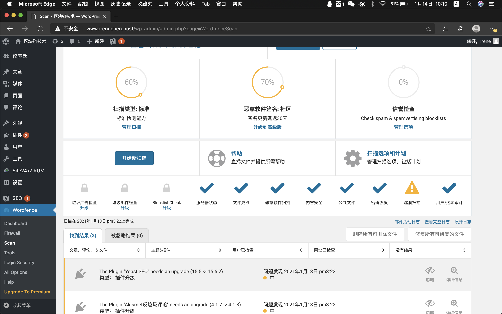
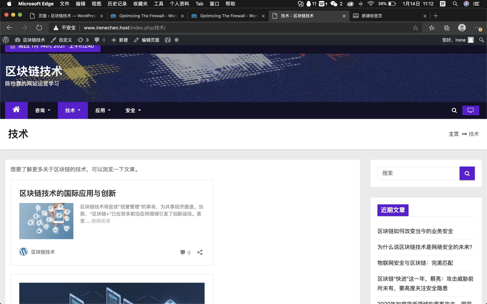
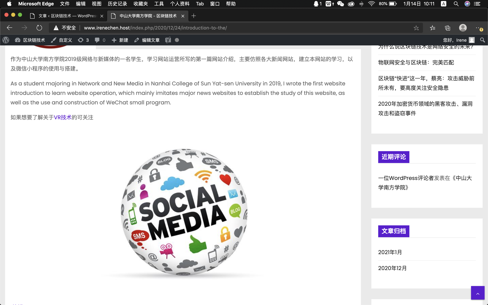
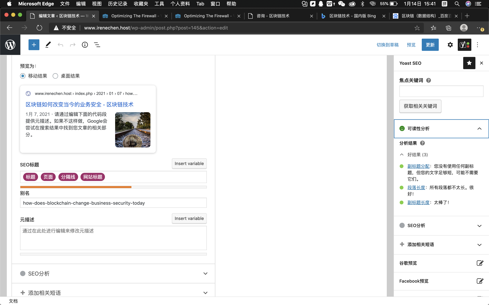
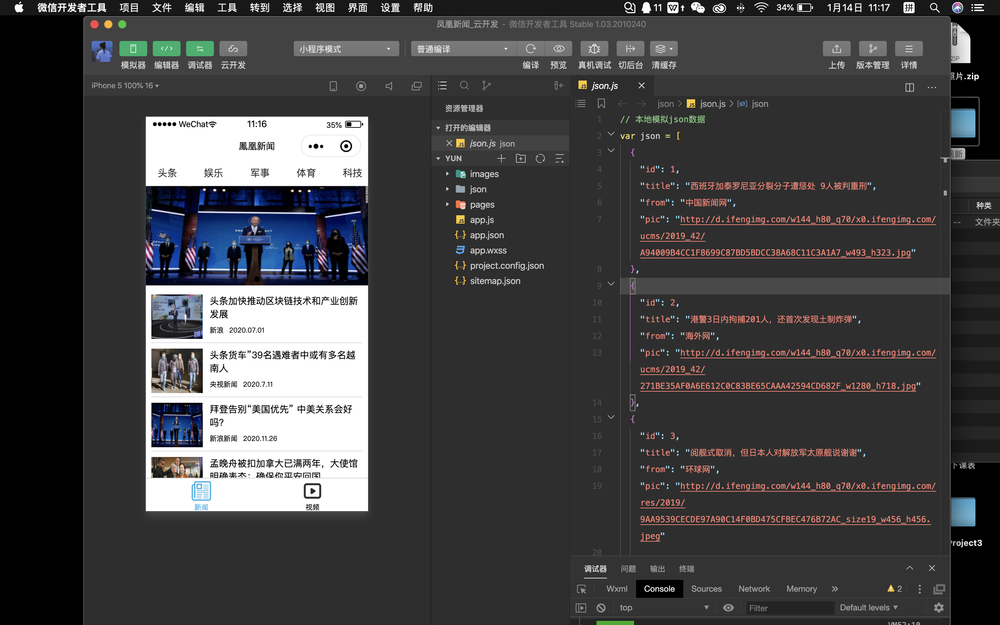
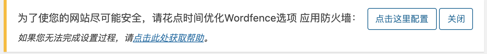
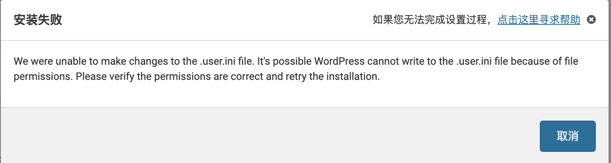
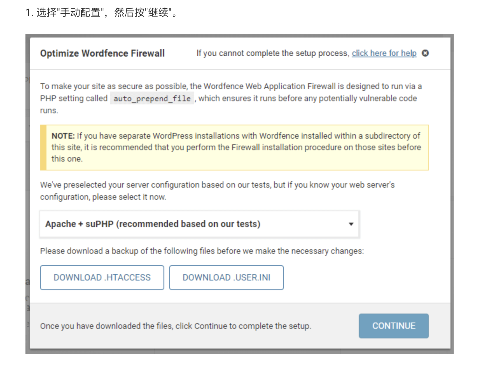

## 区块链技术
> 区块链是一个信息技术领域的术语。从本质上讲，它是一个共享数据库，存储于其中的数据或信息，具有“不可伪造”“全程留痕”“可以追溯”“公开透明”“集体维护”等特征。基于这些特征，区块链技术奠定了坚实的“信任”基础，创造了可靠的“合作”机制，具有广阔的运用前景。
* 区块链是什么？  
> 从技术角度来看，区块链涉及数学、密码学、网络和计算机程序设计等多种科学问题，从应用角度来说，区块链是以分布式共享账簿和数据库为中心、不变性、全过程跟踪、可追溯性，团体维护，具有开放透明等特点，确保区块链的“诚实”和“透明”，为区块链的信任创造打下基础，区块链丰富的应用场景基本上是基于区块链解决信息不对称问题的能力，多主体间的合作实现信赖和合作行动。  

> 区块链是新型分布式数据存储、点对点传输、共识机制、加密算法等计算机技术的应用模型，区块链（Block chain）、货币是一个重要的概念，本质上是一个分散的数据库，作为货币的底层技术，作为一个暗号学的方法相互连接的数据块列表，所有的数据块都包括一个数倍的货币交换信息网络，将信息的有效性（安全性）校验并生成下一块。  

> 作为核心技术自主创新的重要突破，区块链的安全风险被认为是制约当前行业健康发展的大缺陷，频繁的安全事件给行业敲响了警钟，要想拥抱区块链，必须是符合区块链技术体制的安全体要探索和构建体系。

### 我的网站  
[区块链技术](https://www.irenechen.host/)  
* 文章大部分是原创的，但是关于区块链历史盘点类的文章是参考了大量文献以及文章整合而成。
> 制作初衷  
关于“区块链”是近年来的热点，各大公司已在进行区块链的服务，包括阿里巴巴、京东等公司，但是我们常常只是听过这个词并没有详细去了解什么是“区块链”？，所以借由这次机会，详细的去了解一下区块链的具体知识。

##### 关于安全和检验  

##### 关于内外链接  
  
  

##### 关于SEO优化
   

##### 关于小程序    
  

##### 关于备份
> 我设置的是10天备份一次，而在云服务器上是一周制作一次镜像。

### 我遇到的问题  
* 关于Wordfence的优化  
  
开始我尝试了自动优化，可是报错  
  
后来我尝试手动配置   
  
仍然无法优化配置，后续会继续尝试。

* 关于收录  
我尝试了百度以及Bing的收录，可是仍在审核中。

